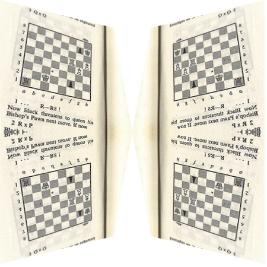
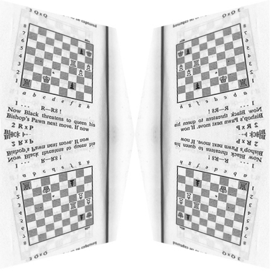
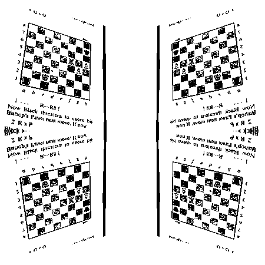
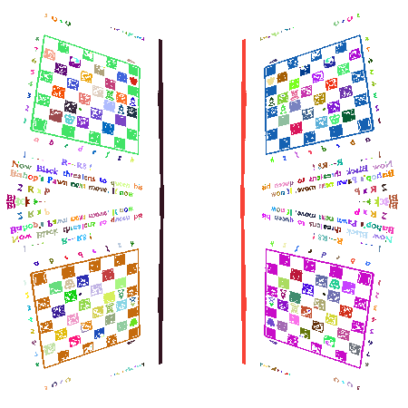
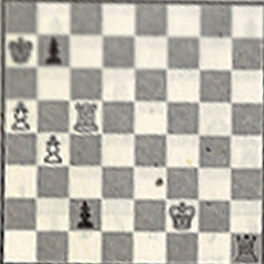
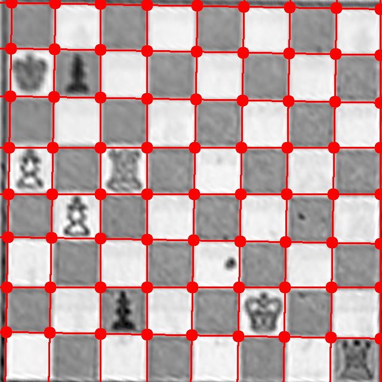

# chessocr

A OCR application for chess boards

The goal of this application is to read an image, detect the chess boards in it and
export them using the FEN notation (https://en.wikipedia.org/wiki/Forsyth–Edwards_Notation).

## Setting stuff up

```
    virtualenv env
    source env/bin/activate
    pip install -r requirements.txt
    python src/main.py <filename>
```

## Roadmap

### Done

#### Board Detection
  - Read Image from file

    

  - Convert image to grayscale.

    

  - Convert to black and white taking into account average image brightness.

    

  - Find connected areas in BW image using floodfill algorithm.

    

  - Filter irrelevant areas:
    - Area either too small or too large.
    - Ratio height/width not close to 1.

#### Area Extraction/Perspective Correction
  - For each area, find the left and rightmost points (lets call them L and R).
    - When ties exist, choose the top and bottommost points for left
      and right, respectively.
  - Find the farthest points on the left and right side of the lined formed by LR.

    

  - Calculate perspective correction transformation using the 4 discovered points.
  - Apply the transformation to a copy of the original image and crop it to size.

    

### Doing

#### Grid Detection/Tile extraction
  - Using OpenCV to detect grids
  


### To Do

#### Piece Detection

#### Rule-based Board Validation/Self-Correction
