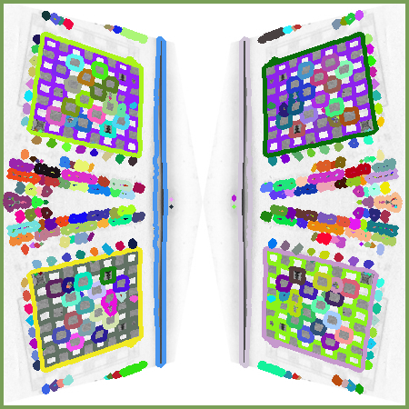
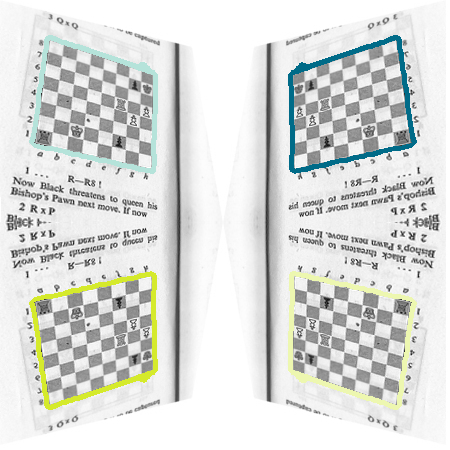
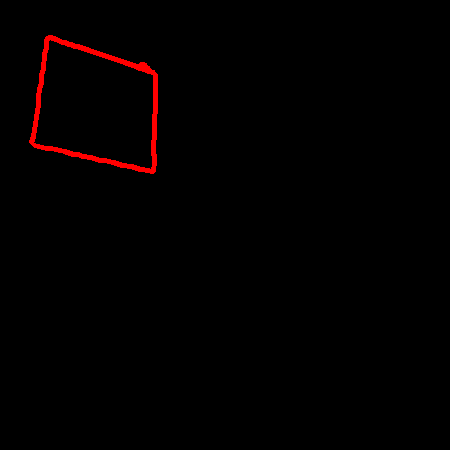
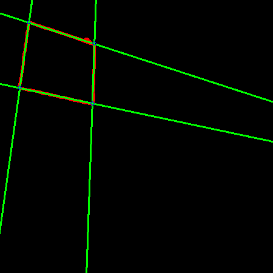
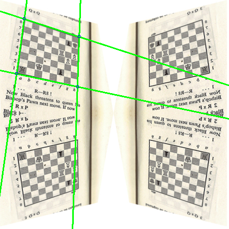
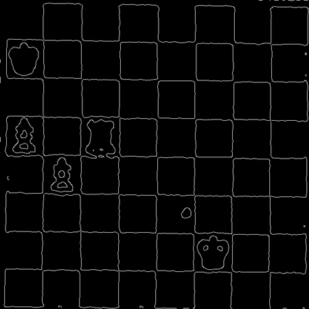
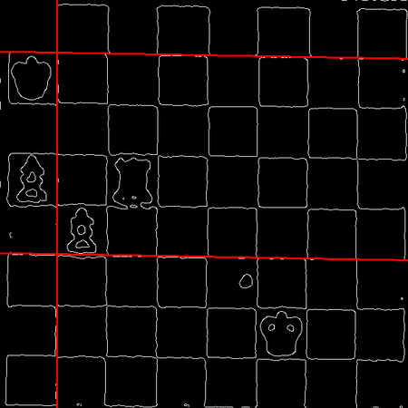
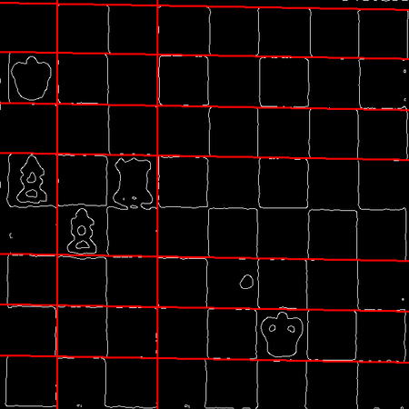

# chessocr

A OCR application for chess boards

The goal of this application is to read an image, detect the chess boards in it and
export them using the FEN notation (https://en.wikipedia.org/wiki/Forsyth–Edwards_Notation).

## Setting stuff up

```
    virtualenv env
    source env/bin/activate
    pip install -r requirements.txt
    python src/main.py <filename>
```

## Roadmap

### Done

#### Board Detection
- Read Image from file


- Convert image to grayscale.


- Convert to black and white taking into account average image brightness.


- Find contours using cv2.findContours



- Filter irrelevant contours:
  - Area either too small or too large.
  - Ratio height/width not close to 1.



#### Board Extraction/Perspective Correction
- Draw each contour in an individual black buffer.



- Find lines by using the standard Hough transform. This is done,
  iteratively, progressively decreasing the accumulator threshold
  parameter until there exactly 2 horizontal lines and 2 vertical
  lines (with some degree of freedom).
  - Lines that are too close to each other are ignored




- Calculate the perspective correction transformation using the 4 points of intersection.


- Apply the transformation to a copy of the original image and crop it to size.


### Doing

#### Grid Detection/Tile extraction
  - Using OpenCV to detect grids

  - Using Canny algorithm for edge detection
    

  - Find lines by using the standard Hough transform. This is done, iteratively, progressively decreasing the accumulator threshold parameter until there are at least 8 horizontal lines and 8 vertical lines. Lines that are too close to each other are ignored

    

    

  - Calculate the line intersections

    

### To Do

#### Piece Detection

#### Rule-based Board Validation/Self-Correction
